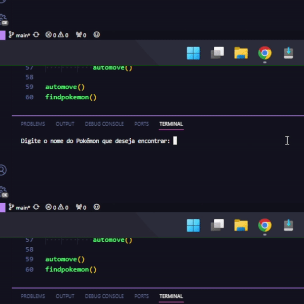
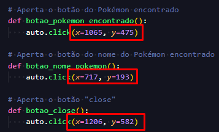

## Portuguese Description
Script de automação do jogo Deluge RPG (Pokémon) para encontrar um Pokémon automaticamente, basicamente o DelugeRPGAutoPokeFinder vai andar pelo mapa sozinho e verificar o nome do Pokémon encontrado, se o nome do Pokémon encontrado for o mesmo do Pokémon procurado, então o script para e exibe um aviso no log que o foi encontrado, mostrando a quantidade de tentativas que foram feitas, senão, o loop retorna repetindo o ciclo até encontrá-lo.  

  

  

# Atenção!
A interação com o navegador é feita utilizando a biblioteca pyautogui, então você precisa substituir os eixos X e Y nas funções que interagem com o cenário, já que o clique é feito de forma virtual.  
Você pode utilizar a função print(pyautogui.position()) para identificar a posição do seu mouse atual.

  

 

## English Description
Deluge RPG (Pokemon) game automation script to find a Pokemon automatically, basically DelugeRPGAutoPokeFinder will walk around the map by itself and check the name of the Pokemon found, if the name of the Pokemon found for the same as the Pokemon sought, then the script stops and displays a warning in the log that it was found, showing the number of attempts that were made, otherwise, the loop returns repeating the cycle until it finds it.

  

  

# Attention!
Interaction with the browser is done using the pyautogui library, so you need to replace the X and Y axes in the functions that interact with the scene, since the click is done virtually.  
You can use the print(pyautogui.position()) function to identify the current mouse position.  

  

